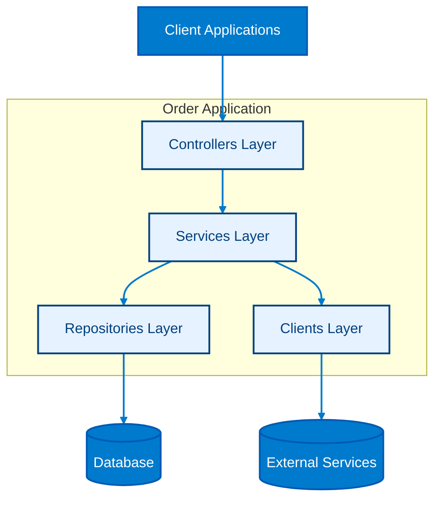

# ShopBridge - Order Service

This repository implements the **Order Service** of the ShopBridge system, designed as part of the **MVP project for the Advanced Back-End module of the Full-Stack Development postgraduate program at CCEC - PUC-Rio**. The service provides a fully functional API for managing orders, enabling creation, retrieval, update, and deletion of order data in a microservices architecture.

Developed using **FastAPI**, the service follows a layered architecture and adheres to industry best practices for RESTful APIs. It is designed to be integrated seamlessly into the system orchestration layer via Docker Compose.

---

## Table of Contents
 
- [Repository Structure](#repository-structure) 
- [Service Design Overview](#service-design-overview)
- [Prerequisites](#prerequisites) 
- [Getting Started](#getting-started)  
- [Managing the Database](#managing-the-database)
- [Running Unit Tests](#running-unit-tests)
- [API Endpoints](#api-endpoints)
- [Notes](#notes) 
- [References](#references) 

---

## Repository Structure

```
shopbridge_order/
├── Lorder_application/                     # Main application directory
│   ├── clients/                            # External API clients or integrations
│   ├── controllers/                        # Route handlers and request controllers
│   ├── core/                               # Core utilities and shared logic
│   ├── data/                               # Data-related utilities or configurations
│   ├── models/                             # Data models and related definitions
│   │   ├── dtos/                           # Data Transfer Objects for request/response shaping
│   │   ├── entities/                       # ORM or domain entities
│   │   ├── enums/                          # Enumerations for constants and types
│   │   └── schemas/                        # Validation schemas (e.g., Pydantic, Marshmallow)
│   ├── repositories/                       # Database access and query logic
│   ├── services/                           # Business logic and service layer
│   ├── tests/                              # Unit and integration tests
│   │   ├── controllers/                    # Tests for controller logic
│   │   ├── repositories/                   # Tests for data access layer
│   │   └── services/                       # Tests for business logic
│   ├── app.py                              # Application entry point
│   ├── Dockerfile                          # Docker configuration for containerization
│   └── .gitignore                          # Git ignore rules for untracked files
├── README.md                               # Project overview and documentation
└── requirements.txt                        # Python dependencies list       
```

---

## Service Design Overview

The **Order Service** follows a layered architecture to ensure separation of concerns, scalability, and maintainability. In addition to repositories for database access, the architecture includes clients, which abstract and encapsulate calls to external services (e.g., communication with Product Service and Logistics Service). This separation ensures that external dependencies are isolated, making the system easier to test, extend, and maintain.

<p align="center">



</p>


### Key Design Principles
- **Layered Architecture**: Controllers → Services → Repositories → Database
- **Domain-Driven Design (DDD) Lite**: Models and DTOs represent business entities clearly.
- **Persistence**: SQLAlchemy with SQLite for local development; easily swappable for other providers.
- **RESTful API**: Follows standard HTTP verbs and status codes.
- **Microservices Ready**: Designed to run independently and integrate via Docker networking.

### Design Decisions
- **Controllers** handle HTTP requests and delegate logic to services.  
- **Services** encapsulate business rules and orchestrate data flow.  
- **Repositories** abstract persistence, making the service database-agnostic.  
- **Migrations** ensure schema evolution is tracked and reproducible.  
- **Tests** validate each layer independently (unit + integration).  

---

---

## Prerequisites

Before using this repository, ensure the following software is installed and properly configured:

- **Python 3.9+**  
  - Used to run the FastAPI application and scripts locally.  
  - Ensure `python` and `pip` are correctly installed and available in your PATH.  
  - Verify installation with:
    ```bash
    python --version
    pip --version
    ```

- **Git** >= 2.30  
  - Required for cloning the repository, managing submodules, and version control.  
  - Recommended to configure your global username and email:
    ```bash
    git config --global user.name "Your Name"
    git config --global user.email "you@example.com"
    ```

- **SQLite**  
  - Used as the default local database for development and testing.  
  - No separate installation is needed if using the Python `sqlite3` module (included in standard library).  

---

## Getting Started

### 1. Clone the repository
```bash
git clone https://github.com/mattsimoessilva/shopbridge_order.git
cd shopbridge_order
cd order_application
```

### 2. Install dependencies
Make sure you have Python 3.9+ and pip installed. Then run:

```bash
pip install -r ../requirements.txt
```

### 3. Run the service
You can run the FastAPI service locally using:

```bash
uvicorn app:app --reload --host 0.0.0.0 --port 3000
```

The API will be available at **http://localhost:3000**.

---

## Managing the Database

The service uses **SQLAlchemy** as the ORM and **SQLite** for persistence.
Migrations are handled using **Alembic**, which integrates seamlessly with SQLAlchemy.

Below is a catalog of the most common commands you’ll need when working with the database.

### Add a new migration
Creates a new migration file to track schema changes.
```bash
alembic revision --autogenerate -m "Migration message"
```

### Apply migrations
Applies all pending migrations to the database.
```bash
alembic upgrade head
```

### Remove the last migration
Rolls back the last migration (only if it hasn’t been applied to the database yet).
```bash
rm alembic/versions/<last_migration_file>.py
```

### Reset the database
Drops the database and recreates it with the latest migrations.
```bash
rm database.db
alembic upgrade head
```

---

## Running Unit Tests

Unit and integration tests are located in the **order_application_tests** directory.  
Below is a catalog of the most common commands for running and filtering tests.

### Run all tests
Executes the entire test suite.
```bash
pytest order_application_tests
```

### Run tests with detailed output
Provides verbose output for better debugging and visibility.
```bash
pytest -v order_application_tests
```

### Run a specific test class
Runs only the tests within a specific class.
```bash
pytest -k "TestClassName"
```

### Run a specific test method
Runs a single test method within a class.
```bash
pytest -k "test_method_name"
```

---

## API Endpoints

### Orders


| Method | Endpoint                      | Description                                 |
|--------|-------------------------------|---------------------------------------------|
| POST   | `/api/orders`                 | Create a new order record.                  |
| GET    | `/api/orders`                 | Retrieve all order records.                 |
| GET    | `/api/orders/{id}`            | Retrieve an order record by its unique ID.  |
| PUT    | `/api/orders/{id}`            | Update an existing order record by its unique ID.            |
| DELETE | `/api/orders/{id}`            | Delete an order record by its unique ID.    |
| PATCH  | `/api/orders/{id}/status`     | Update only the status of an order record.  |

---

### Addresses

| Method | Endpoint                      | Description                                  |
|--------|-------------------------------|----------------------------------------------|
| POST   | `/api/addresses`              | Create a new address record.                 |
| GET    | `/api/addresses`              | Retrieve all address records.                |
| GET    | `/api/addresses/{id}`         | Retrieve an address record by its unique ID. |
| PUT    | `/api/addresses/{id}`         | Update an existing address record by its unique ID.           |
| DELETE | `/api/addresses/{id}`         | Delete an address record by its unique ID.   |

---

All endpoints follow REST conventions and return appropriate HTTP status codes (200, 201, 204, 400, 404, 500) with JSON payloads.

---

## Notes

- The service uses **SQLite** for local persistence.  
- It is designed to operate as part of the **ShopBridge microservices system**, communicating with other services via internal Docker networking.  
- All timestamps are in ISO 8601 format, and UUIDs are used for unique identification of records.

---

## References

[1] S. Newman, *Building Microservices: Designing Fine-Grained Systems*. O’Reilly Media, 2015.  